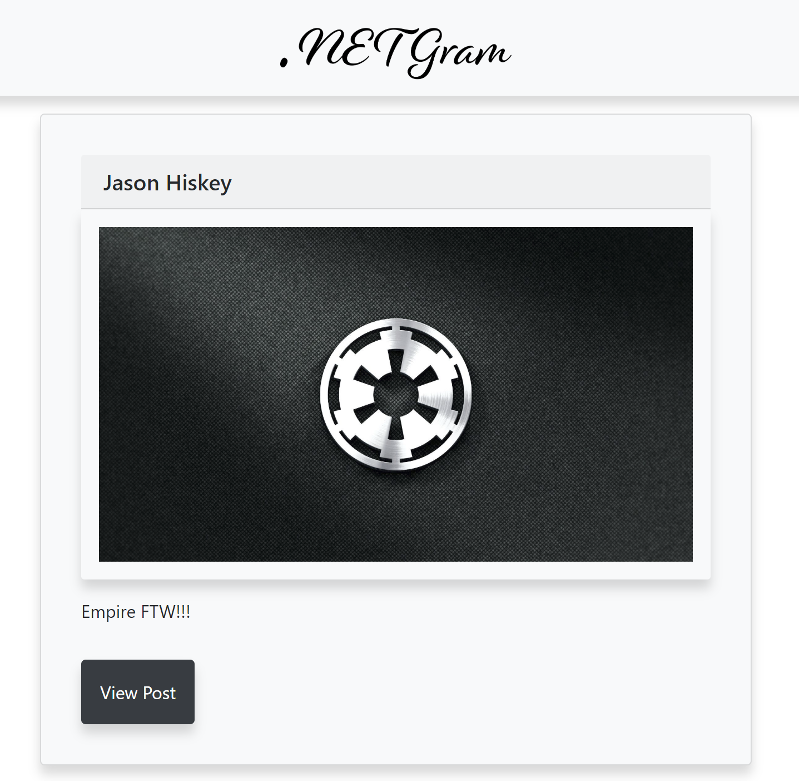
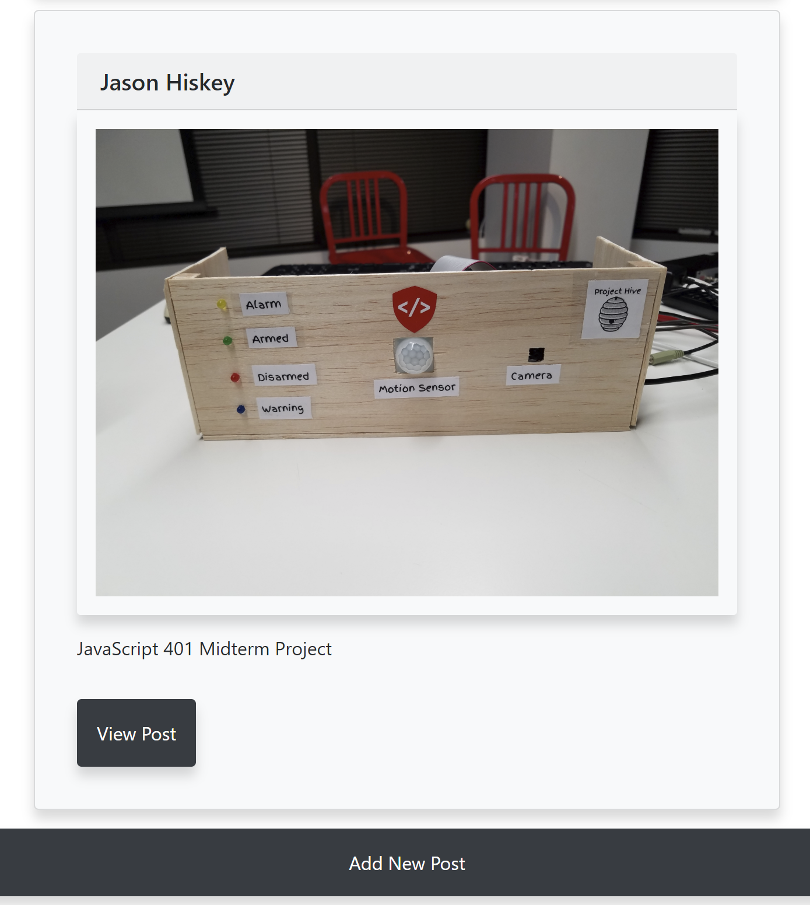
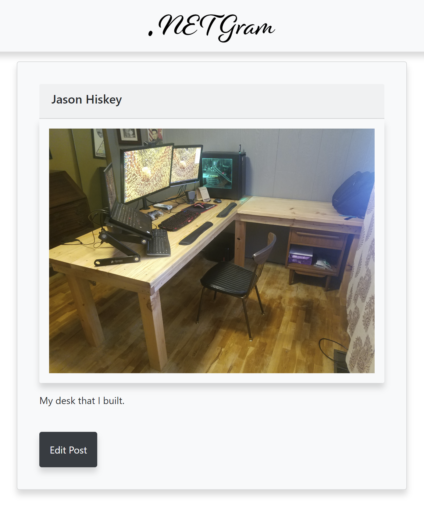
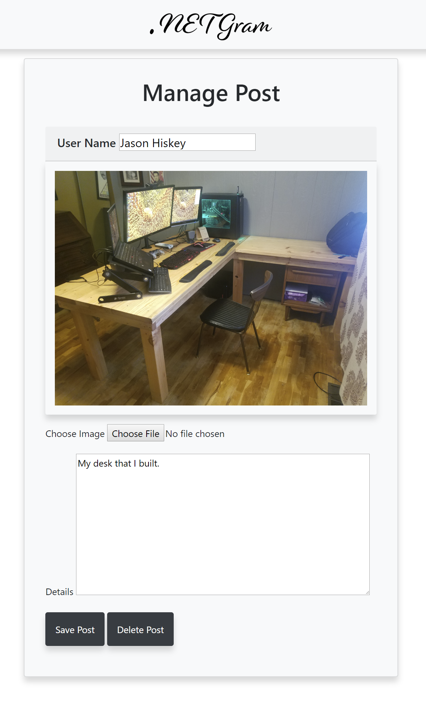

# Lab: .NET-gram!

https://jasonsdotnetgram.azurewebsites.net/
 
## Directions
#### Part 1
Build a “.NET-gram”!

This is part 1 of 2 of our Razor Pages Web Application.

Create a brand new empty web application within .NET Core 2.2
Set up your web application to use the Razor Pages architectural pattern.
Integrate the repository design pattern into your application
Seed you database with approx 5 posts with pre-populated information
Ensure your application is utilizing User Secrets.
Create a Razor Pages web application (starting from an empty web app) that holds posts of images and details.

Your first part of the app should have all of the above, as well as…

Home page that shows all of the posts created
Have placeholders for images for now, since we don’t quite know how to upload images yet!
A landing page for each post that shows all the details of the post.
The ability to edit the details of a post.
Capability to add and delete posts.
Don’t worry about user accounts. For now, each user will just input their name as the author of the post.

Stretch
Add the ability to comment on posts!
Work ahead on Part 2!
#### Part 2
Keep building off of your existing razor page app:

Add some CSS! Make it look nice!
Enable the capability to upload files and store them in to Azure Blob Storage.
Use Azure Blob Storage to store all of your images.
Capture the link of each Blob and store it’s location with each post in the DB.
Deploy your application to Azure.
Your README should contain:

Introduction to the app (3 -5 sentences)
How to use
Screenshots of the application (2 or 3 good images with captions/explanations)
Deployment link (top of the README, please)
Technologies used
Architectural Design
Any additional important information…

## Tests

Test each method within your services data layer.

## Application Introduction

This application is designed to mimic some of Instagram's capabilities. A user can create, view and edit posts. When a post is created or edited the user has the option of uploading an image. The image is uploaded to Azure Blob and the image is then rendered on the site using a reference to its location in the Blob.
  
## Technologies Used

- Azure
  - Deployment
  - Blob Storage
- Bootstrap
  - Styling
- MVC
  - Razor Pages

## Architectual Design

- Single class schema
  - Post
    - ID
    - Name
    - Details
    - URL

## Example Usage
### On Page Load

     

### View Post is Pressed

  

### Edit Post is Pressed

  